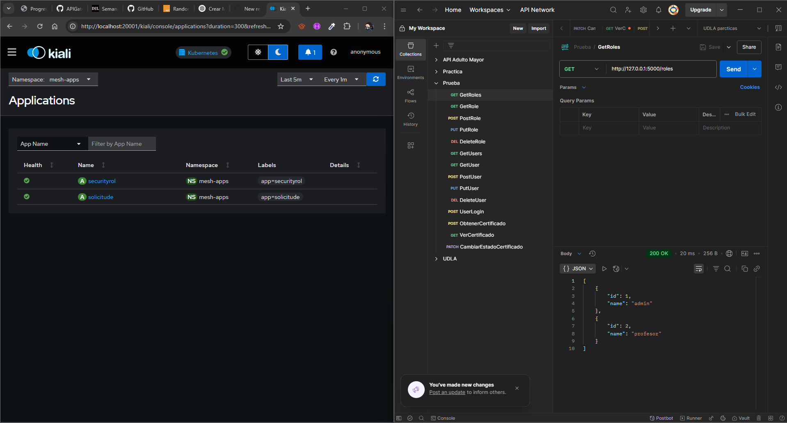

# Plataforma Integrada de Solicitudes Académicas

Este proyecto implementa una solución de integración para la Universidad, permitiendo gestionar solicitudes académicas de estudiantes (certificados, legalizaciones, homologaciones y equivalencias) mediante microservicios REST y SOAP, expuestos a través de un API Gateway (WSO2 API Manager) y considerando seguridad, trazabilidad y resiliencia.

---

## Contexto y Objetivos

Actualmente existen 3 sistemas independientes:
1. **Sistema Académico** (REST API – gestionado internamente)
2. **Sistema de Certificación** (SOAP – externo, expuesto por un proveedor estatal)
3. **Sistema de Seguridad y Roles** (interno, usa tokens JWT)

**Objetivos específicos:**
- Integrar servicios REST y SOAP en una solución funcional.
- Exponer todos los servicios a través de un API Gateway (WSO2).
- Diseñar la solución considerando trazabilidad, seguridad y resiliencia.
- Aplicar patrones como Circuit Breaking y Retry usando Service Mesh (diseño/pseudocódigo).

---

## Arquitectura de la Solución

### Diagrama de Alto Nivel


**Descripción:**
- El API Gateway (WSO2) expone los endpoints REST y aplica políticas de seguridad y rate limiting.
- El microservicio `SolicitudService` valida JWT, gestiona solicitudes y consume el sistema SOAP externo para certificados.
- El sistema de Seguridad y Roles gestiona usuarios, roles y autenticación JWT.
- Se aplican patrones de resiliencia (Circuit Breaking y Retry) en la comunicación con el sistema SOAP.
- Se consideran puntos de monitoreo y trazabilidad en cada microservicio y en el gateway.

---

## Estructura del Proyecto

```
Progreso_2/
│
├── SecureAndRoles/           # Microservicio de usuarios y roles
│   ├── app.py
│   ├── controller/
│   ├── model/
│   ├── utils/
│   │   ├── auth.py           # Decorador y lógica de verificación de JWT
│   │   └── database.py       # Instancia de SQLAlchemy
│   └── requirements.txt
│
├── Solicitudes/              # Microservicio de solicitudes
│   ├── app.py
│   ├── controller/
│   ├── model/
│   ├── utils/
│   │   ├── database.py       # Instancia de SQLAlchemy
│   │   ├── soap_certificado.py # Lógica para consumir el servicio SOAP de certificados
│   │   └── token.py          # Decorador y lógica de verificación de JWT externo
│   └── requirements.txt
│
├── proxy/                    # Configuración de despliegue (K8s, Istio)
│
├── kind-config.yaml          # Configuración de cluster kind
└── README.md
```

---

## Instalación y Ejecución

### 1. Clonar el repositorio

```bash
git clone <url-del-repo>
cd Progreso_2
```

### 2. Instalar dependencias

#### Solicitudes
```bash
cd Solicitudes
python -m venv env
./env/Scripts/activate  # Windows
pip install -r requirements.txt
```

#### SecureAndRoles
```bash
cd ../SecureAndRoles
python -m venv env
./env/Scripts/activate  # Windows
pip install -r requirements.txt
```

### 3. Ejecutar los microservicios

#### Solicitudes
```bash
cd Solicitudes
python app.py
```

#### SecureAndRoles
```bash
cd SecureAndRoles
python app.py
```

---

## Endpoints principales

### Microservicio: Solicitudes

- **POST /solicitudes**
  - Crea una nueva solicitud.
  - **Body JSON:**
    ```json
    {
      "tipo": "string",
      "usuario_id": 1,
      "detalle": "string",
      "username": "usuario"
    }
    ```
  - **Respuesta:** Solicitud creada con certificado.

- **GET /solicitudes/{id}**
  - Obtiene una solicitud por ID y retorna el certificado actualizado.
  - **Respuesta:**
    ```json
    {
      "id": 1,
      "tipo": "string",
      "usuario_id": 1,
      "estado": "pendiente",
      "fecha": "YYYY-MM-DD HH:MM:SS",
      "detalle": "string",
      "username": "usuario",
      "certificado": { ... }
    }
    ```

- **PATCH /solicitudes/{id}**
  - Actualiza el estado de una solicitud.
  - **Body JSON:**
    ```json
    { "estado": "procesado" }
    ```

- **GET /health**
  - Health check del microservicio.

#### Utils relevantes en Solicitudes
- **utils/soap_certificado.py**: Lógica para consumir el servicio SOAP (simulado) y obtener certificados.
- **utils/token.py**: Decorador `@token_required` y función para validar JWT contra el microservicio de autenticación externo.

---

### Microservicio: SecureAndRoles

- **POST /users**
  - Crea un usuario.
  - **Body JSON:**
    ```json
    {
      "username": "usuario",
      "email": "correo@ejemplo.com",
      "password": "clave",
      "role_id": 1
    }
    ```

- **POST /login**
  - Autenticación de usuario.
  - **Body JSON:**
    ```json
    {
      "username": "usuario",
      "password": "clave"
    }
    ```
  - **Respuesta:**
    ```json
    { "token": "<jwt>" }
    ```

- **GET /users**
  - Lista todos los usuarios (requiere JWT).

- **GET /users/{id}**
  - Obtiene un usuario por ID (requiere JWT).

- **PUT /users/{id}**
  - Actualiza un usuario (requiere JWT).

- **DELETE /users/{id}**
  - Elimina un usuario (requiere JWT).

- **GET /roles**
  - Lista todos los roles.

- **POST /roles**
  - Crea un rol.

- **GET /health**
  - Health check del microservicio.

#### Utils relevantes en SecureAndRoles
- **utils/auth.py**: Decorador `@token_required` y lógica de validación de JWT local.
- **utils/database.py**: Instancia de SQLAlchemy para modelos y controladores.

---

## API Gateway y Seguridad (WSO2)

Se recomienda exponer los endpoints a través de **WSO2 API Manager**:
- Registra el endpoint `/solicitudes` y aplica:
  - Política de seguridad por token JWT.
  - Política de rate limiting.

**Pasos generales en WSO2:**
1. Crear una nueva API REST en WSO2 API Publisher.
2. Configurar los recursos `/solicitudes`, `/solicitudes/{id}` y métodos (POST, GET, PATCH).
3. Habilitar la autenticación JWT (OAuth2) en la sección de seguridad.
4. Configurar una política de rate limiting (ejemplo: 10 requests/minuto).
5. Publicar la API y suscribirse desde el API Store.
6. Usar el token JWT generado para consumir los endpoints protegidos.

**Ejemplo de configuración de recursos en WSO2:**
- **Resource:** `/solicitudes` (POST)
- **Resource:** `/solicitudes/{id}` (GET, PATCH)
- **Security:** OAuth2 (JWT)
- **Throttling Policy:** 10 requests/minuto

**Nota:** Puedes exportar la configuración de la API desde WSO2 o adjuntar capturas de pantalla como evidencia.

---

## Circuit Breaking y Retry (Service Mesh)
- Se recomienda aplicar Circuit Breaking y Retry en la comunicación con el sistema SOAP.
- Ejemplo de configuración (Istio, pseudocódigo):
  ```yaml
  apiVersion: networking.istio.io/v1alpha3
  kind: VirtualService
  metadata:
    name: solicitudes-vs
  spec:
    hosts:
      - solicitudes
    http:
      - route:
          - destination:
              host: solicitudes
        retries:
          attempts: 2
          perTryTimeout: 2s
        fault:
          abort:
            httpStatus: 500
            percentage:
              value: 10
        circuitBreaker:
          simpleCb:
            maxConnections: 1
            httpMaxPendingRequests: 1
            sleepWindow: 60s
            consecutiveErrors: 3
  ```

---

## Monitoreo y Trazabilidad
- Se recomienda implementar monitoreo y trazabilidad usando herramientas como Prometheus, Grafana, Jaeger o Zipkin.
- Métricas sugeridas:
  - Latencia y tasa de error de endpoints
  - Trazas distribuidas entre microservicios
  - Uso de recursos (CPU, memoria)
- Se pueden instrumentar los microservicios con middlewares de logging y tracing.

---

## Notas
- Todos los endpoints protegidos requieren el header:
  ```
  Authorization: Bearer <token>
  ```
- El microservicio de Solicitudes consume el servicio de SecureAndRoles para validar JWT.
- El endpoint `/health` es usado para readiness/liveness en Kubernetes/Istio.

---

## Union con istio:


