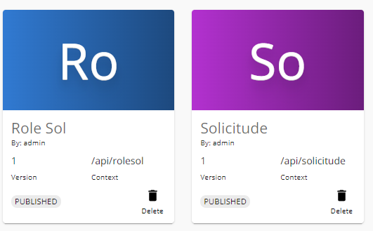

# Plataforma Integrada de Solicitudes Académicas

Este proyecto implementa una solución de integración para la Universidad, permitiendo gestionar solicitudes académicas de estudiantes (certificados, legalizaciones, homologaciones y equivalencias) mediante microservicios REST y SOAP, expuestos a través de un API Gateway (WSO2 API Manager) y considerando seguridad, trazabilidad y resiliencia.

---

## Contexto y Objetivos

Actualmente existen 3 sistemas independientes:
1. **Sistema Académico** (REST API – gestionado internamente)
2. **Sistema de Certificación** (SOAP – externo, expuesto por un proveedor estatal)
3. **Sistema de Seguridad y Roles** (interno, usa tokens JWT)

**Objetivos específicos:**
- Integrar servicios REST y SOAP en una solución funcional.
- Exponer todos los servicios a través de un API Gateway (WSO2).
- Diseñar la solución considerando trazabilidad, seguridad y resiliencia.
- Aplicar patrones como Circuit Breaking y Retry usando Service Mesh (diseño/pseudocódigo).

---

## Arquitectura de la Solución

### Diagrama de Alto Nivel


**Descripción:**
- El API Gateway (WSO2) expone los endpoints REST y aplica políticas de seguridad y rate limiting.
- El microservicio `SolicitudService` valida JWT, gestiona solicitudes y consume el sistema SOAP externo para certificados.
- El sistema de Seguridad y Roles gestiona usuarios, roles y autenticación JWT.
- Se aplican patrones de resiliencia (Circuit Breaking y Retry) en la comunicación con el sistema SOAP.
- Se consideran puntos de monitoreo y trazabilidad en cada microservicio y en el gateway.

---

## Estructura del Proyecto

```
Progreso_2/
│
├── SecureAndRoles/           # Microservicio de usuarios y roles
│   ├── app.py
│   ├── controller/
│   ├── model/
│   ├── utils/
│   │   ├── auth.py           # Decorador y lógica de verificación de JWT
│   │   └── database.py       # Instancia de SQLAlchemy
│   └── requirements.txt
│
├── Solicitudes/              # Microservicio de solicitudes
│   ├── app.py
│   ├── controller/
│   ├── model/
│   ├── utils/
│   │   ├── database.py       # Instancia de SQLAlchemy
│   │   ├── soap_certificado.py # Lógica para consumir el servicio SOAP de certificados
│   │   └── token.py          # Decorador y lógica de verificación de JWT externo
│   └── requirements.txt
│
├── proxy/                    # Configuración de despliegue (K8s, Istio)
│
├── kind-config.yaml          # Configuración de cluster kind
└── README.md
```

---

## Instalación y Ejecución

### 1. Clonar el repositorio

```bash
git clone <url-del-repo>
cd Progreso_2
```

### 2. Instalar dependencias

#### Solicitudes
```bash
cd Solicitudes
python -m venv env
./env/Scripts/activate  # Windows
pip install -r requirements.txt
```

#### SecureAndRoles
```bash
cd ../SecureAndRoles
python -m venv env
./env/Scripts/activate  # Windows
pip install -r requirements.txt
```

### 3. Ejecutar los microservicios

#### Solicitudes
```bash
cd Solicitudes
python app.py
```

#### SecureAndRoles
```bash
cd SecureAndRoles
python app.py
```

---

## Endpoints principales

### Microservicio: Solicitudes

- **POST /solicitudes**
  - Crea una nueva solicitud.
  - **Body JSON:**
    ```json
    {
      "tipo": "string",
      "usuario_id": 1,
      "detalle": "string",
      "username": "usuario"
    }
    ```
  - **Respuesta:** Solicitud creada con certificado.

- **GET /solicitudes/{id}**
  - Obtiene una solicitud por ID y retorna el certificado actualizado.
  - **Respuesta:**
    ```json
    {
      "id": 1,
      "tipo": "string",
      "usuario_id": 1,
      "estado": "pendiente",
      "fecha": "YYYY-MM-DD HH:MM:SS",
      "detalle": "string",
      "username": "usuario",
      "certificado": { ... }
    }
    ```

- **PATCH /solicitudes/{id}**
  - Actualiza el estado de una solicitud.
  - **Body JSON:**
    ```json
    { "estado": "procesado" }
    ```

- **GET /health**
  - Health check del microservicio.

#### Utils relevantes en Solicitudes
- **utils/soap_certificado.py**: Lógica para consumir el servicio SOAP (simulado) y obtener certificados.
- **utils/token.py**: Decorador `@token_required` y función para validar JWT contra el microservicio de autenticación externo.

---

### Microservicio: SecureAndRoles

- **POST /users**
  - Crea un usuario.
  - **Body JSON:**
    ```json
    {
      "username": "usuario",
      "email": "correo@ejemplo.com",
      "password": "clave",
      "role_id": 1
    }
    ```

- **POST /login**
  - Autenticación de usuario.
  - **Body JSON:**
    ```json
    {
      "username": "usuario",
      "password": "clave"
    }
    ```
  - **Respuesta:**
    ```json
    { "token": "<jwt>" }
    ```

- **GET /users**
  - Lista todos los usuarios (requiere JWT).

- **GET /users/{id}**
  - Obtiene un usuario por ID (requiere JWT).

- **PUT /users/{id}**
  - Actualiza un usuario (requiere JWT).

- **DELETE /users/{id}**
  - Elimina un usuario (requiere JWT).

- **GET /roles**
  - Lista todos los roles.

- **POST /roles**
  - Crea un rol.

- **GET /health**
  - Health check del microservicio.

#### Utils relevantes en SecureAndRoles
- **utils/auth.py**: Decorador `@token_required` y lógica de validación de JWT local.
- **utils/database.py**: Instancia de SQLAlchemy para modelos y controladores.

---

## API Gateway con WSO2

### Documentación y pasos para exponer APIs con WSO2 API Manager

#### 1. Iniciar WSO2 API Manager

Ubicación de WSO2:
```powershell
cd C:\Users\user\GitRepositories\UDLA\Integracion\wso2am-4.5.0\bin
.\api-manager.bat --start
```

Accede al API Publisher desde tu navegador:
[https://localhost:9443/publisher/apis](https://localhost:9443/publisher/apis)

Si no has iniciado sesión, usa las credenciales:
- **Usuario:** admin
- **Contraseña:** admin

#### 2. Crear una nueva API

En la página de Publisher de API Manager:
[https://localhost:9443/publisher](https://localhost:9443/publisher)

- Haz clic en **Start From Scratch**.
- Ingresa:
  - **Nombre de la aplicación**
  - **Contexto** (Ejemplo: `/api/weather`)
  - **Versión**
  - **Endpoint** al que apuntará la API (si usas Service Mesh, pon el puerto del forwarding)

#### 3. Configurar los recursos/endpoints

En la sección de resources, agrega los endpoints que deseas exponer. Ejemplo:
- **HTTP Verb:** POST
  - **URI Pattern:** `/verify`
- **HTTP Verb:** GET
  - **URI Pattern:** `/users/{userId}`
- Haz clic en el **+** para agregar cada recurso.
- Si usas Swagger, asegúrate de que el header `Authorization` esté presente.

Expande el método POST para agregar parámetros:
- En **body**, selecciona `application/json` como content-type, márcalo como requerido y define el esquema.
- Haz clic en **Guardar**.

#### 

---

#### 4. Crear una aplicación para manejo de solicitudes

Accede al Developer Portal:
[https://localhost:9443/devportal/](https://localhost:9443/devportal/)

- Haz clic en **Aplicaciones** (parte superior izquierda).
- Haz clic en **Agregar Nueva Aplicación** y completa:
  - **Nombre de la aplicación**
  - **Solicitudes por minuto**
  - **Descripción** (opcional)
- Haz clic en **Guardar**.
- En el menú izquierdo, selecciona **Fichas OAuth2** y haz clic en **Generate keys**.

#### 
#### 

---

#### 5. Suscripción de la aplicación al API

- Vuelve a la pantalla de APIs y selecciona la API que deseas suscribir.
- Haz clic en **Suscripciones** (parte derecha).
- Selecciona la aplicación creada y haz clic en **Suscribirse**.

#### 

---

#### 6. Configuración de rutas y testing

- En la sección de rutas, configura los endpoints de cada microservicio.
- Ejemplo de rutas:
  - 
  - 

- Para probar la generación de rutas y consumo de la API:
  - 

---

## Circuit Breaking y Retry (Service Mesh)
- Se recomienda aplicar Circuit Breaking y Retry en la comunicación con el sistema SOAP.
- Ejemplo de configuración (Istio, pseudocódigo):
  ```yaml
  apiVersion: networking.istio.io/v1alpha3
  kind: VirtualService
  metadata:
    name: solicitudes-vs
  spec:
    hosts:
      - solicitudes
    http:
      - route:
          - destination:
              host: solicitudes
        retries:
          attempts: 2
          perTryTimeout: 2s
        fault:
          abort:
            httpStatus: 500
            percentage:
              value: 10
        circuitBreaker:
          simpleCb:
            maxConnections: 1
            httpMaxPendingRequests: 1
            sleepWindow: 60s
            consecutiveErrors: 3
  ```

---

## Monitoreo y Trazabilidad
- Se recomienda implementar monitoreo y trazabilidad usando herramientas como Prometheus, Grafana, Jaeger o Zipkin.
- Métricas sugeridas:
  - Latencia y tasa de error de endpoints
  - Trazas distribuidas entre microservicios
  - Uso de recursos (CPU, memoria)
- Se pueden instrumentar los microservicios con middlewares de logging y tracing.

---

## Notas
- Todos los endpoints protegidos requieren el header:
  ```
  Authorization: Bearer <token>
  ```
- El microservicio de Solicitudes consume el servicio de SecureAndRoles para validar JWT.
- El endpoint `/health` es usado para readiness/liveness en Kubernetes/Istio.

---

## Despliegue en Kind + Istio

A continuación se describen los pasos para desplegar los microservicios en un clúster local usando [Kind](https://kind.sigs.k8s.io/) y [Istio](https://istio.io/):

### 1. Construir las imágenes Docker de los microservicios

Desde la raíz del proyecto, ejecuta:

```bash
docker build -t securityrol-service ./SecureAndRoles
docker build -t solicitudel-service ./Solicitudes
```

### 2. Crear el clúster Kind con soporte para Ingress

Crea un archivo `kind-config.yaml` con el siguiente contenido:

```yaml
kind: Cluster
apiVersion: kind.x-k8s.io/v1alpha4
nodes:
- role: control-plane
  extraPortMappings:
  - containerPort: 80
    hostPort: 8080
```

Luego crea el clúster:

```bash
kind create cluster --name istio-mesh --config kind-config.yaml
```

### 3. Subir las imágenes Docker al clúster Kind

```bash
kind load docker-image securityrol-service --name istio-mesh
kind load docker-image solicitudel-service --name istio-mesh
```

### 4. Aplicar los manifiestos YAML de Kubernetes

Asegúrate de tener los archivos de despliegue en la carpeta `proxy/`:

```bash
kubectl apply -f proxy/securityrol-service.yml
kubectl apply -f proxy/solicitudel-service.yml
```

### 5. Instalar Istio y habilitar Kiali

Sigue la [guía oficial de Istio](https://istio.io/latest/docs/setup/getting-started/) para instalar Istio en tu clúster Kind.  
Luego, para abrir el dashboard de Kiali:

```bash
istioctl dashboard kiali
```

### 6. Port forwarding para exponer los servicios localmente

En terminales separadas, ejecuta:

```bash
kubectl port-forward -n mesh-apps svc/securityrol-service 5000:80
kubectl port-forward -n mesh-apps svc/solicitudel-service 5001:80
```

Ahora puedes acceder a los microservicios en `http://localhost:5000` y `http://localhost:5001`.

---

**Notas:**
- Asegúrate de que los manifiestos YAML de Kubernetes estén correctamente configurados para el namespace `mesh-apps` y tengan las anotaciones necesarias para Istio.
- Puedes monitorear el tráfico y la salud de los servicios desde el dashboard de Kiali.
